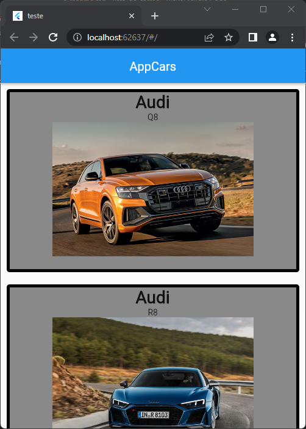

# Arquivos Finais

Nos arquivos finais foi ensinado como passar argumentos para o StatelessWidgets. Os argumentos são usados para podermos reutilizar o mesmo Widget de forma diferente.

exemplo de uso do Widget com argumentos:

```dart
    CarroWidget("Audi", "Q8", "audi_q8.jpg")
    CarroWidget("Audi", "R8", "audi_r8.jpg")
```

Cada vez que chamamos o Widget `CarroWidget`, passamos valores diferentes, para que assim o flutter exiba de forma diferente o mesmo Widget.

---

## Imagem de como a tela principal do app ficou


