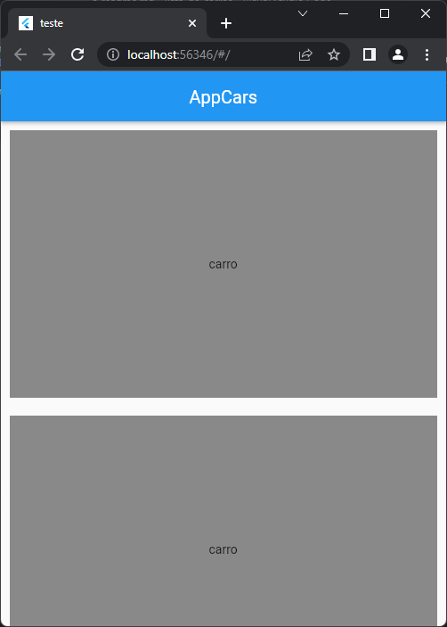

# ARQUIVOS INICIAIS

Nos arquivos, o professor iniciou o conceito de StatelessWidget. Com isso criamos um Widget chamado `CarroWidget`. E no arquivo `./view/tela_principal.dart` usamos esse Widget para exibir quadrados cinzas na tela.

exempo de uso do Widget:

```dart
    CarroWidget(),
    CarroWidget()
```

Cada vez que chamamos o Widget `CarroWidget`, o flutter exibe o Widget na tela. No caso do exemplo, o flutter iria exibir o componente duas vezes.

## Imagem de como a tela principal deve ficar:


